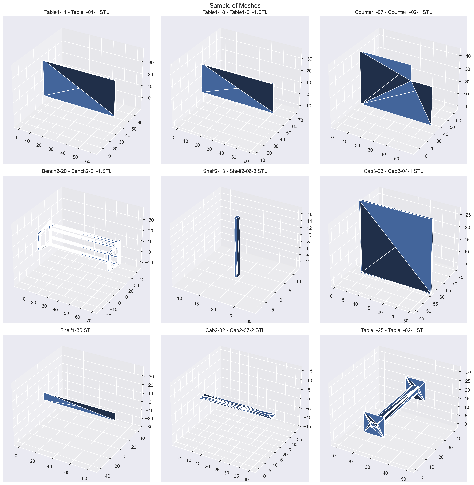
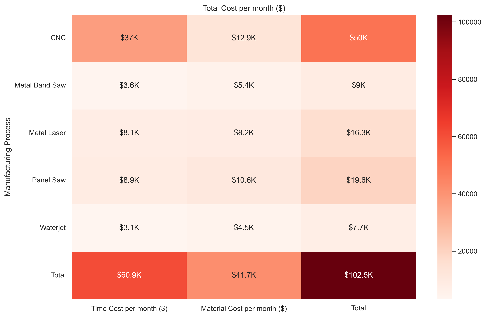
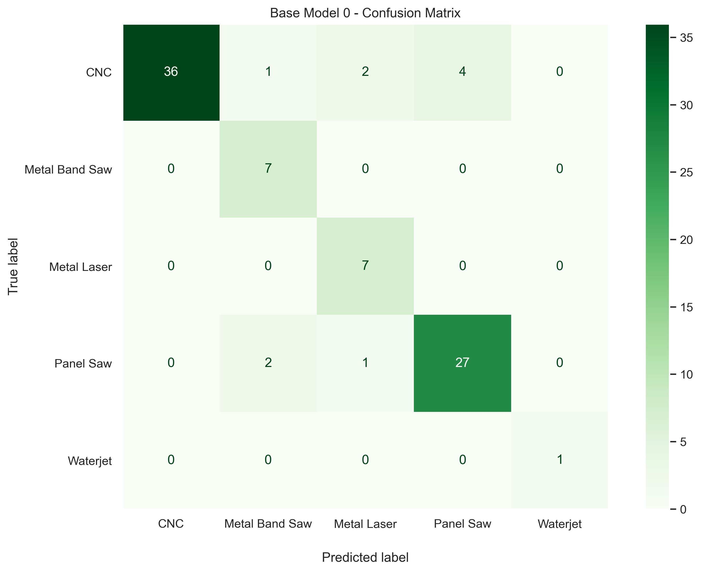
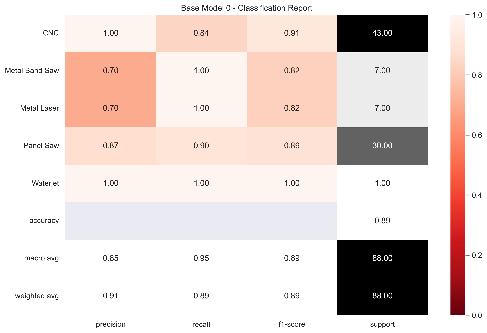
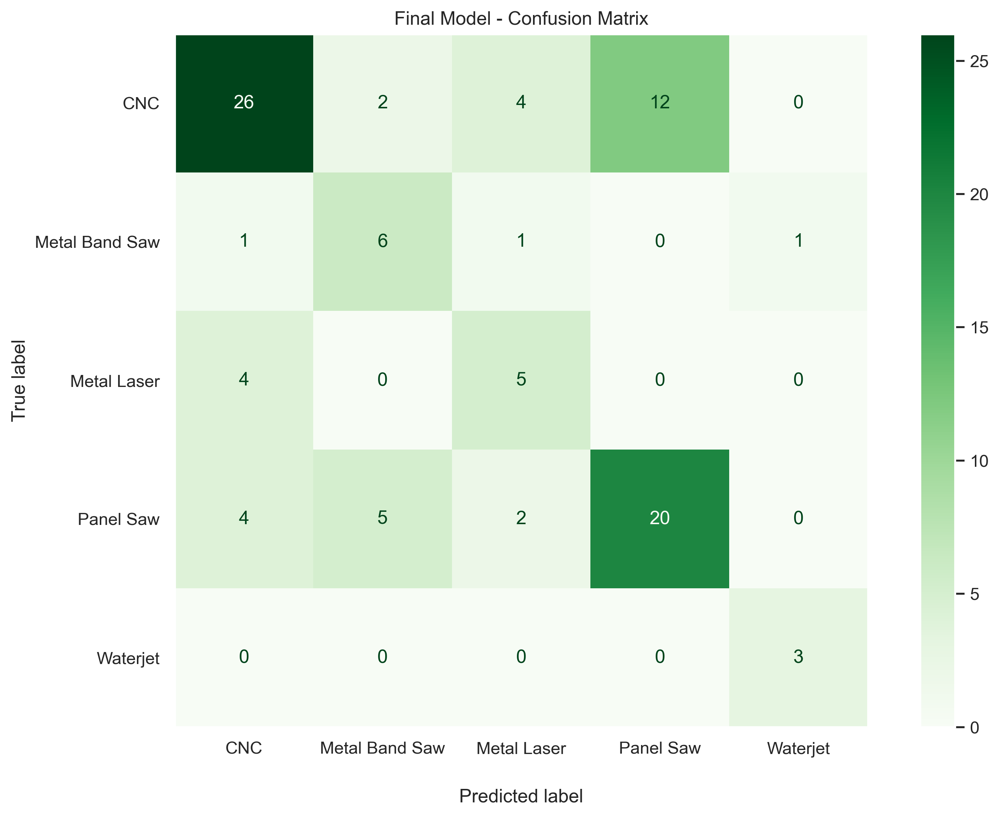
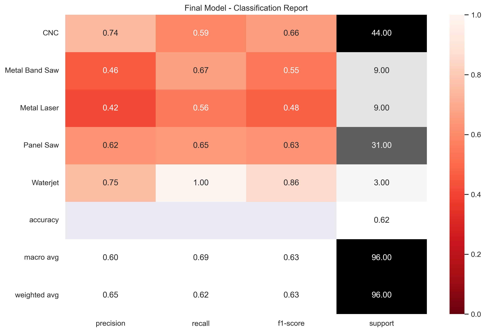

# Part Classification using Neural Networks

***

Tim Fuger

## Project Overview

Our client Fab Inc. is a custom architecture millwork and metalwork manufacturer. They would like to boost the automation and efficiency in the engineering department by automating the process of assigning the first step in the manufacturing process to a part. This project used a dataset of 3D mesh models of 1000 different parts supplied by the company to train a Pytorch nueral network to predict manufacturing process assignment for parts. Our final model achieves a high precision and F1-score in the most expensive class (CNC) and can be used immediately by the company to expedite and reduce error in the assignment process.





## Business Understanding

### Business Problem

> Our stakeholder is looking to **reduce engineering time and error** to **assign the manufacturing process** for a custom fabricated **part**.


Our client Fab Inc. is a custom architecture millwork and metalwork manufacturer. They have already worked to automate large portions of the shop/production floor by having robots and more sophisticated machinery and software work in tandem with shop employees. Since upgrading production equipment and processes, they have seen the bottleneck in their facility start to shift from the production departments to their engineering and design departments. With the increased efficiency in production, the shop floor is always ahead of engineering and design, which means that the shop is consistently waiting on digital files and shop documentation in order to continue working on projects. They would like to boost the automation in the engineering and design departments.

Our client's long term goal is to create a system which can automatically identify and program parts for various assemblies. This in turn will reduce the amount of engineering time required for each project, and will free the team up to focus on other responsibilities. For this project is the catalyst of this long term goal. It will start by classifying the first step in the manufacturing process for each of the parts.

The company has 5 main types of cutting processes that they work with that they would like to have classified:

- CNC
- Panel Saw
- Metal Laser
- Metal Band Saw
- Waterjet


### Defining Metrics

The metric that is most important in our analysis is precision. We need to be really precise in our predictions, as an imprecise prediction means a material gets sent to the wrong workcell. This, at the least, means lost time for sending the material back to the previous station, but, at the worst, it could mean lost time and lost material if someone cuts stock they should not be cutting. And for the most expensive process, we will want to have that process be as precise. That process will incur the highest time and material cost so we do not want anything being sent to that process that isnt the correct material or part, as it would cost the highest in lost time and material.

Our second metric to use (should there be only slight precision differences between models) will be F1-score. This will help us to balance precision against recall as we analyze the models.


## Data Understanding

### Dataset

The dataset contains around 1000 models which are all parametric variations on 10 different types of fixtures. These models were collected over the course of a month as they passed from the engineering department to the production department. Each fixture is made up of a variety of parts, with each part having a different shape and a different material assigned. The parts make up assemblies which are identified and shown in the table below.

| Assembly  | Type  |
|---|---|
| Cab1  | Base Cabinet  |
| Cab2  | Wall Cabinet  |
| Cab3  | Pantry Cabinet  |
| Shelf1  | Removable Shelf  |
| Shelf2  | Floating Shelf  |
| Counter1  | Order Counter  |
| Station1  | Utensil Station  |
| Bench1  | Bench with back  |
| Bench2  | Bench with no back  |
| Table1  | Table  |


Each of the solidworks assembly parts were exported to a STL mesh file format using the [Export-to-Mesh](https://github.com/SigmaRelief/SOLIDWORKS-Export-to-Mesh/tree/master) function provided by SigmaRelief.

Samples of these meshes are shown in the project overview section


### Time and Material Cost Analysis

After a thorough analysis of the time and material estimates supplied by the company, we came to find that they undertsandably spend quite a bit of time and material costs in cutting parts through these manufacturing processes we are analyzing.



The engineering time and cost results in 8 hours and 7% assignment error per month. A full day of engineering time is equivalent to 800 dollars and the 7% error rate would be 7,140 dollars in loss from the total in the chart above. This would mean the company has around a 7,940 dollar loss every month from these assignments.


## Data Preparation


## Modeling

All of the models produced are based on the PointNet model architecture in order to process the mesh files. The architecture is shown in the original paper, ["PointNet: Deep Learning on Point Sets for 3D Classification and Segmentation"](https://arxiv.org/abs/1612.00593) as well as Nikita Karaevv's [Pointnet repo](https://github.com/nikitakaraevv/pointnet) based on the original paper that we used as reference as well.

This approach utilizes a nueral network through pytorch, where all of the data being fed into the model is resampled to have the same size.


Our models include one base model, an augmented data model, and two fine tuned augmented data models. All of the models have a Logsoftmax function in order to generate probabilities for each of the classes of the multiclass classification problem. We will show that the fine tuned model seems to give us the best results due to the additional convolutional layers, dropout layers, and specialized AdamW optimizer. 

The base model produced high results on its own, but this was run without any data augmentation applied to the data. This would do poor in situations where data generalization is necessary (for example a shelf at an angle would most likely be classified incorrectly).






The final model had normalization and random rotations applied to the Z direction for data transformations for data augmentation. 






## Evaluation

### Recommendations

The client is looking for an algorithm that can automatically assign parts to different cutting machine processes. While our model does not have the accuracy we would want across all classes, it does get the closest to the precision we are looking for in the most expensive (CNC) class. The ultimate goal of this project is to implement this machine learning algorithm for use in the engineering department. While the algorithm is not ready to be fully implemented, there are some actionable recommendations that the company can take right now:

- Engineers should be required to triple check assigning parts to the CNC class, as this class costs 71% of the total cost for the company.

- The CNC class has the highest time investment of any other class. Given the amount of time incurred on each machine currently (30 minutes cycle time), it would be beneficial to complete a return on investment analysis of tools and methods that could decrease this time. We are not sure of the tools and methods currently in use, but automatic feed conveyors and material handling systems are just some tools to decrease the cycle time on these machines.

- That are specific features of a part that will dictate what manufacturing process the part might undergo. There seems to be a consistent formula that is followed, so in order to reduce engineering time this formula can be written in a flow diagram which can be used by an administrative member of team who would assign manufacturing processes instead.

### Model Implementation

- The algorithm can be used for a probationary 90 day peiod to automatically assign the CNC designation to parts. It will not be used for any other class or parts during this time. During this time, the model will also be improved by integrating the next steps detailed below. 

- All items designated not CNC will be checked by the engineering team to assign them to the correct processes.

- This model should be improved during the 90 day probationary period, and reevaluated at that time for the precision and F1-score of the model. If the model passes a 99% for the metrics, then the model can be put into full deployment by being applied to classify manufacturing processes for the department.


### Next Steps

Further analysis could yield additional insights such as:

- In the cost material analysis, we would want to calculate the square footage of each individual part and then use that as a basis to determine more accurate costs for each part based on the current dataset

- In the time cost analysis, we would want to implement an analysis program to each machine that would store the part's program and run time for each part's program (depending on the machine, this can include load, unload and machine time), in order to have a more accurate average of time estimates per machine. Those time estimates would then be fed into a program which could estimate program run times for the part models that we have in the dataset.

- Increasing the amount of data that the algorithm trains on would give a larger variety of parts to pull from. While 1,000 3D models is a good start, 10,000 or 20, 000 would be even better for improving the performance of the model.

- Integrating the materials into the modeling would definitely improve the model performance simply because the machines can only cut certain materials.

- The nueral network modeling was accomplished by using the PointNet nueral network architecture. The data would benefit from having another model or two that had a different architecture, just to be able to compare the differences between them. For example, integrating the face normals of the meshes would contribute to improving performance for the model as it would be able to analyze the mesh face information along with the mesh vertex information.

- If possible, since that data is coming from 3d models and not the real world, it would be ideal to have the data in a format that is cleaner if possible such as a step file or other nurbs file. Currently the data science industry does not have a methodology for processing this data due to it being "unstructured".

- After the model has reached a point where full deployment is possible, the next project to undertake would be to handle the sequencing of the assembly of these cut components to start to work on reducing assembly time on the floor.

## Repository Navigation


* [Notebook](Notebook.ipynb) contains the main data analysis code and notes for this project.

* [Mesh_Preprocessing_Notebooks/Train-Split-Multiclass-Meshes](Mesh_Preprocessing_Notebooks/Train-Split-Multiclass-Mesh_stl-to-obj.ipynb) contains code which uses a csv file to save meshes (stl) as a different file format (obj) in a new directory according to their classes. The second half of the code will further take the meshes in this newly created directory, and split them into folders for train, validation, and test sets of data.

* Meshes/ folder contains all the meshes used for the dataset. The data in this folder can be obtained using the notes in the Reproducibility section below.

 * Meshes/SW_Models/ folder contains all of the original solidworks models that the stl parts were generated from. These models are saved in a Solidworks for makers file format.
 
  * Meshes/SW_Models/Part_Classification-Variations csv file contains all of the different size variations of each of the 10 main assemblies.

  * Meshes/SW_Models/Assembly_Meshes folder contains STL files of each entire assembly of components.

* [Part_Classification](Part_Classification.csv) contains all the 3d model part names, assembly iterations, material, and the manufacturing process identified. This file was created by having a human go through each part and label them accordingly in this csv file.

* [Visualizations/](Visualizations) folder contains all the visualizations from the notebook such as plots and graphs.

* [Pytorch_Model_Save/](Pytorch_Model_Save) folder contains all the saved Pytorch model dictionaries, which can be loaded into the model.

* [Presentation/](Presentation/) folder contains all of the presentation content.

* [Presentation/Part-Processing](Presentation/Part-Processing.pptx) powerpoint presentation.

* [Presentation/Part-Processing](Presentation/Part-Processing.pdf) pdf file of presentation.


## Reproducibility

This repo can be directly downloaded and contains all of the required files for running except for the dataset. The dataset for this project is being hosted on kaggle and needs to be inserted in the following directory in the repository:

```
└── Part-Processing
    └── Meshes
            
```

All specific versions of packages used in this project are located in the conda environment.yml file located at the top level of this repo.


For additional info, contact Tim Fuger at tfuger10@gmail.com